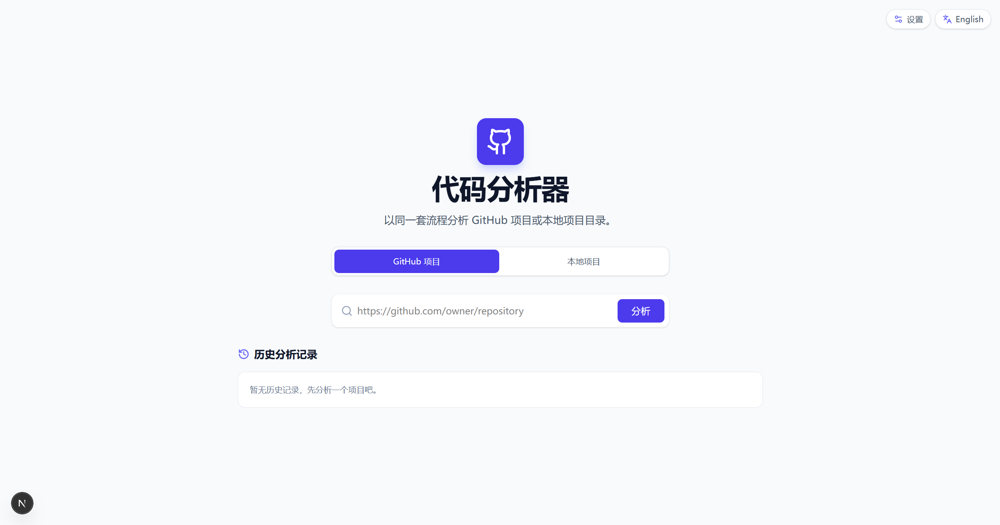

# GitHub Code Analyzer

一个基于 Next.js 的代码分析工具，支持分析 GitHub 仓库和本地项目目录，并通过 Gemini 生成项目摘要、入口文件判断、函数调用链与功能模块划分。



## 功能特性

- 支持两种数据源：
    - GitHub 仓库（公开仓库或配置 Token 的私有仓库）
    - 本地目录（基于浏览器 File System Access API）

- AI 分析能力：
    - 项目摘要（中英文）
    - 主要编程语言识别（中英文）
    - 技术栈提取
    - 候选入口文件识别与验证
    - 递归子函数调用链分析
    - 功能模块自动聚类

- 可视化与交互：
    - 文件树浏览与代码查看
    - 调用链全景视图（Panorama）
    - 模块筛选与重分析
    - 系统日志与 AI 调用日志

- 历史记录能力：
    - 分析快照自动保存到浏览器 LocalStorage
    - 支持从首页历史记录快速回放分析结果
    - 本地项目历史支持“快照回看”，如需重新读取文件内容需重新选择目录


## 技术栈

- `Next.js 15`
- `React 19`
- `TypeScript`
- `Tailwind CSS 4`
- `@google/genai`
- `@xyflow/react`

## 目录结构

```text
app/
  page.tsx                 # 首页（模式切换、历史记录）
  analyze/page.tsx         # 主分析页面
components/
  FileTree.tsx             # 文件树
  CodeViewer.tsx           # 代码查看器
  Panorama.tsx             # 调用链全景
  SettingsModal.tsx        # 运行参数配置弹窗
lib/
  dataSource.ts            # GitHub/本地数据源抽象
  analysisHistory.ts       # 历史记录存取
  appSettings.ts           # 配置解析（环境变量 + 本地持久化）
  localSession.ts          # 本地目录会话
```

## 环境要求

- Node.js `>= 18`（建议 LTS）
- npm `>= 9`

## 快速开始

1. 安装依赖

```bash
npm install
```

2. 配置环境变量

```bash
cp .env.example .env
```

3. 填写 `.env` 中至少以下变量：

- `GEMINI_API_KEY`（必填）
- `GITHUB_TOKEN`（可选，建议配置，避免 GitHub API 限流）

4. 启动开发环境

```bash
npm run dev
```

5. 打开浏览器访问

```text
http://localhost:3000
```

## 环境变量说明

以下变量可在 `.env` 中设置，也可通过应用内 Settings 覆盖部分参数。

| 变量名 | 必填 | 默认值 | 说明 |
| --- | --- | --- | --- |
| `GEMINI_API_KEY` | 是 | - | Gemini API Key |
| `GEMINI_BASE_URL` | 否 | `https://generativelanguage.googleapis.com` | Gemini 兼容网关地址 |
| `GEMINI_MODEL` | 否 | `gemini-3-flash-preview` | 模型名称 |
| `GITHUB_TOKEN` | 否 | 空 | GitHub Token（私有仓库、提高限额） |
| `GEMINI_DRILLDOWN_MAX_DEPTH` | 否 | `2` | 递归下钻最大深度（0~6） |
| `GEMINI_KEY_SUBFUNCTION_COUNT` | 否 | `10` | 每层关键子函数数量（1~30） |
| `GEMINI_RETRY_MAX_RETRIES` | 否 | `0` | 网络抖动重试次数（0~10） |
| `GEMINI_RETRY_BASE_DELAY_MS` | 否 | `600` | 重试基础退避毫秒（100~10000） |

## 使用说明

### GitHub 项目分析

1. 首页选择 `GitHub 项目`
2. 输入仓库 URL（如 `https://github.com/owner/repo`）
3. 点击分析，等待 AI 完成摘要、入口识别、调用链和模块分析

### 本地项目分析

1. 首页选择 `本地项目`
2. 点击“选择本地目录”，授权浏览器读取目录
3. 进入分析页后自动执行分析流程

## 历史记录与本地项目说明

- 历史记录会自动保存在浏览器 `LocalStorage`。
- GitHub 项目可直接从历史记录完整回放。
- 本地项目从历史进入时，如果没有当前目录会话（`sessionId`），可查看分析快照，但无法直接重新读取本地文件内容。
- 如需再次打开本地文件，请返回首页重新选择本地目录。

## 可用脚本

```bash
npm run dev     # 启动开发环境
npm run build   # 构建生产版本
npm run start   # 启动生产服务
npm run lint    # 运行 ESLint
npm run clean   # 清理 Next 缓存
```

## 常见问题

### 1. GitHub 仓库分析失败或速率受限

- 检查仓库 URL 是否正确
- 配置有效的 `GITHUB_TOKEN`
- 私有仓库需要 Token 拥有访问权限

### 2. AI 请求失败（Failed to fetch / NetworkError）

- 检查 `GEMINI_API_KEY` 是否有效
- 如使用代理，确认 `GEMINI_BASE_URL` 可访问
- 适当增大 `GEMINI_RETRY_MAX_RETRIES` 与 `GEMINI_RETRY_BASE_DELAY_MS`

### 3. 本地项目历史中无法重新打开文件

- 这是浏览器本地目录授权机制限制
- 回到首页重新选择本地目录即可恢复文件读取能力

## 注意事项

- 当前历史记录保存在浏览器本地，不会自动同步到服务端。
- 大型仓库分析会增加 API 调用与耗时，请合理设置下钻深度与子函数数量。
